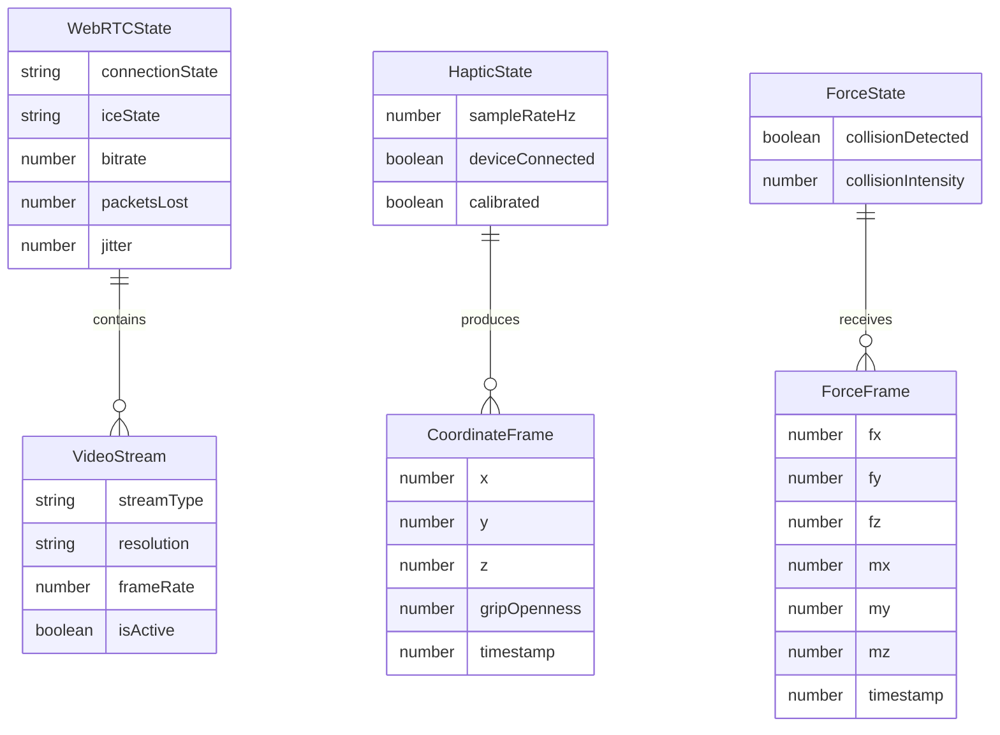

## 1. 架构设计

```mermaid
flowchart TB
    subgraph "前端 (Vue3 + WebRTC)"
        "双目视频渲染引擎" -- "Canvas 2D" --> "左眼/右眼视图"
        "WebRTC协商模块" -- "SDP/ICE" --> "信令通道"
        "触觉手柄驱动" -- "500Hz WebSocket" --> "C++ 网关"
        "力反馈解析" -- "WebSocket 推送" --> "雷达图渲染"
        "状态管理 (Pinia)" -- "响应式状态" --> "全组件同步"
    end

    subgraph "后端 (C++)"
        "信令服务器" -- "HTTP/WebSocket" --> "SDP中转"
        "机器人网关" -- "GStreamer" --> "4K编码推流"
        "机器人网关" -- "运动控制" --> "机械臂驱动"
        "机器人网关" -- "力传感器" --> "力矩阵计算"
    end

    "信令通道" --> "信令服务器"
    "C++ 网关" --> "机器人网关"
    "信令服务器" --> "机器人网关"
```

## 2. 技术说明

- **前端**：Vue3@3 + TypeScript + Vite + TailwindCSS + Pinia + vue-router
- **初始化工具**：vite-init (vue-ts 模板)
- **后端**：C++ 信令服务器与机器人网关（独立部署，本仓库定义API契约）
- **数据库**：无（实时流数据，不持久化）
- **通信协议**：
  - WebRTC：双目4K视频流点对点传输
  - WebSocket：触觉手柄坐标/力反馈数据双向传输
  - HTTP：信令交换（SDP Offer/Answer、ICE Candidate）

## 3. 路由定义

| 路由 | 用途 |
|------|------|
| `/` | 手术控制台主页——视频、操控、力反馈主界面 |
| `/device` | 设备管理——连接配置、触觉手柄校准 |

## 4. API定义

### 4.1 WebRTC 信令 API (HTTP)

```typescript
interface SdpOffer {
  sdp: string
  type: 'offer'
  streamType: 'binocular-left' | 'binocular-right'
  sessionId: string
}

interface SdpAnswer {
  sdp: string
  type: 'answer'
  sessionId: string
}

interface IceCandidate {
  candidate: string
  sdpMid: string
  sdpMLineIndex: number
  sessionId: string
}
```

**POST /api/signal/offer** — 主刀医生端发送 SDP Offer
**POST /api/signal/answer** — 机器人端返回 SDP Answer
**POST /api/signal/ice-candidate** — 交换 ICE Candidate

### 4.2 WebSocket 数据通道 API

**连接端点**: `ws://{gateway_host}:8765/haptic`

#### 前端 → 后端（触觉手柄数据，500Hz）

```typescript
interface HapticInputFrame {
  timestamp: number
  position: {
    x: number
    y: number
    z: number
  }
  gripOpenness: number
  quaternion: {
    w: number
    x: number
    y: number
    z: number
  }
}
```

#### 后端 → 前端（力反馈数据）

```typescript
interface ForceFeedbackFrame {
  timestamp: number
  force: {
    fx: number
    fy: number
    fz: number
  }
  torque: {
    mx: number
    my: number
    mz: number
  }
  collisionDetected: boolean
  collisionIntensity: number
}
```

### 4.3 系统状态 API (HTTP)

**GET /api/system/status** — 获取系统整体状态

```typescript
interface SystemStatus {
  webrtc: {
    connectionState: RTCPeerConnectionState
    iceState: RTCIceConnectionState
    videoCodec: string
    resolution: string
    bitrate: number
    packetsLost: number
    jitter: number
  }
  websocket: {
    connected: boolean
    latencyMs: number
    hapticRateHz: number
    forceRateHz: number
  }
  robot: {
    armed: boolean
    emergencyStop: boolean
    jointPositions: number[]
  }
  session: {
    id: string
    startTime: number
    duration: number
  }
}
```

## 5. 服务器架构图

```mermaid
flowchart TB
    "HTTP 信令接口" --> "SDP 会话管理器"
    "SDP 会话管理器" --> "ICE 中转"
    "WebSocket 网关" --> "触觉数据解析"
    "触觉数据解析" --> "运动学求解"
    "运动学求解" --> "机械臂驱动接口"
    "力传感器接口" --> "力矩阵计算"
    "力矩阵计算" --> "WebSocket 推送"
    "双目摄像头接口" --> "GStreamer 编码"
    "GStreamer 编码" --> "WebRTC 推流"
```

## 6. 数据模型

### 6.1 前端状态模型 (Pinia)



### 6.2 关键数据结构定义

所有核心数据结构已在 4.2 节 TypeScript 接口定义中给出，前端 Pinia Store 将基于这些接口管理响应式状态。
